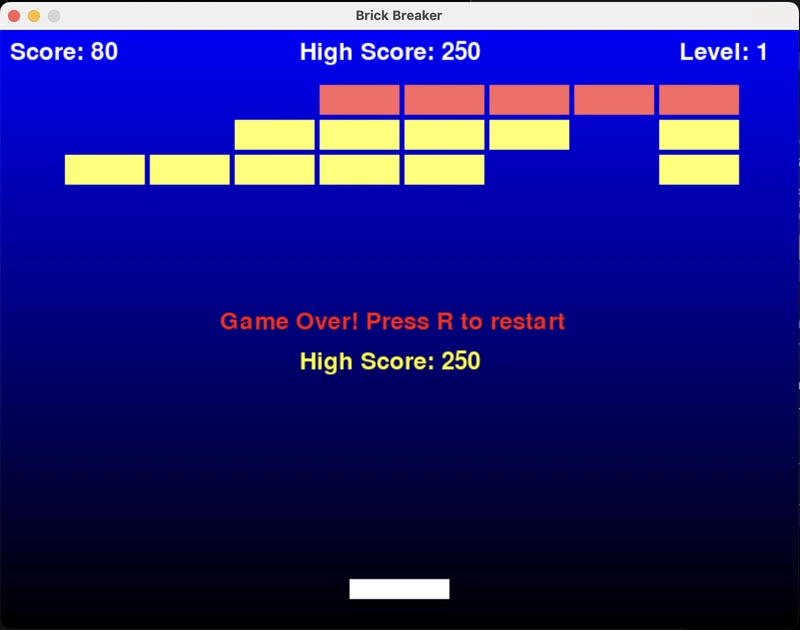

# Brick Breaker Game

A classic arcade-style Brick Breaker game built with Python and PyGame, featuring multiple levels, power-ups, and enhanced gameplay mechanics.



## Features

### Core Gameplay
- Control a paddle with left and right arrow keys
- Bounce the ball to break bricks
- Multiple balls can be in play simultaneously
- Game ends when all balls fall below the paddle
- Win by clearing all bricks across all levels

### Multiple Levels
- 4 progressively challenging levels
- Increasing number of brick rows and columns per level
- Ball speed increases with each level
- More durable bricks in higher levels

### Power-up System
Three types of power-ups randomly drop from destroyed bricks:
- **Enlarged Paddle (Purple P)**: Doubles paddle width for 10 seconds
- **Extra Ball (Cyan B)**: Adds another ball to the game
- **Slow Ball (Green S)**: Reduces ball speed by 30% for 10 seconds

### Brick Types
- Bricks with different durability (1-3 hits)
- Health indicator displayed on multi-hit bricks
- Bricks change appearance as they take damage
- Dynamic hit animations with flash and shake effects
- Particle explosion effects when bricks are destroyed

### Visual Effects
- Particle explosion system when bricks break
- Flash and shake animations when bricks are hit
- Shrinking fade-out animations for destroyed bricks
- Persistent particles that outlive the brick
- Power-up visual indicators with letters and colors
- Semi-transparent pause menu overlay

### Game Elements
- Score tracking with points for hits and brick destruction
- High score system that persists between game sessions
- Pause menu (press 'P') with game instructions
- Background graphics with blue gradient
- Sound effects for ball collisions
- Active power-up timers displayed on screen

## Controls
- **Left/Right Arrow Keys**: Move paddle
- **P**: Pause/Resume game
- **R**: Restart game after game over
- **N**: Advance to next level when level is complete

## Installation

1. Ensure you have Python installed (Python 3.6 or higher recommended)
2. Install PyGame:
   ```
   pip install pygame
   ```
3. Run the game:
   ```
   python brick_breaker.py
   ```

## Assets
The game will automatically create an assets directory for:
- Background image (auto-generated)
- Sound effects (you need to provide these)
- High score data (automatically saved in JSON format)

### Sound Effects
For sound effects, place an audio file named `bounce.mp3` or `bounce.wav` in the assets directory.

## Game Mechanics

### Scoring
- 1 point for hitting a brick
- 10 points for destroying a brick
- Score carries over between levels
- High score is saved between game sessions

### Ball Physics
- Realistic collision detection using distance-based calculations
- Angle-based bouncing off the paddle
- Corner collision handling for both paddle and bricks
- Multiple independent balls with separate physics

### Power-up Effects
- Power-ups have visible timers showing remaining duration
- Multiple power-ups can be active simultaneously
- Power-ups fall from destroyed bricks (20% chance)
- Visual indicators for active power-ups

## Development
This game was created using:
- Python
- PyGame library
- Object-oriented programming principles
- Particle systems for visual effects

Feel free to modify the game parameters in the constants section at the top of the code to customize difficulty, speeds, or dimensions.

## Future Enhancements
Potential features for future versions:
- Additional power-up types
- Boss levels
- Custom level editor
- Multiplayer mode
- More sound effects and music
